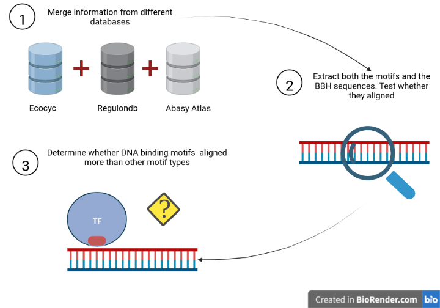

README
================

-   [Open Data Analysis - Bidirectional Best Hit (BBH)
    analysis](#open-data-analysis---bidirectional-best-hit-bbh-analysis)
    -   [Project structure](#project-structure)
    -   [Pipeline Overview](#pipeline-overview)
    -   [Used datasets](#used-datasets)
    -   [Scripts overview](#scripts-overview)
    -   [References](#references)

# Open Data Analysis - Bidirectional Best Hit (BBH) analysis

Welcome! This is a repository with a BLAST sequence analysis. In order
to add information regarding the functional conservation we are going to
perform an analysis motif. Particularly, we are going to focus on the
functional conservation of TFs (which are proteins that bind to DNA
sequence and active/repress the transcription of their regulated genes).
We expected that if the orthologous TFs identified by BBH have a
functional conservation, the sequences that aligned in the BBH must be
enriched with DNA-binding motifs.

## Project structure

    ## .
    ## ├── bin
    ## │   └── R
    ## │       ├── fun
    ## │       └── scripts
    ## ├── data
    ## │   ├── processed
    ## │   └── raw
    ## ├── docs
    ## └── figs
    ## 
    ## 9 directories

The repository contains the following folders:

-   `bin`: Contains binary files (e.g .R, .sh., .py, among other). For
    each coding language, two sub-folders exist: `fun` where all the
    functions are placed, and `scripts` where all the main codes are
    placed.

-   `data`: Contains flat-files (.tsv, .tab, .csv, among other). It
    contains two sub-folders: `raw` where the original datasets are
    placed and `processed` where all the files with modifications are
    placed.

-   `figs`: Contains all the figures either generated for the scripts or
    necessary to compile the .Rmd file for the report.

-   `docs`: .Rmd and .html files from the **project report**.

## Pipeline Overview

The workflow consist of three main parts (**Figure 1**) each one
associated with an script in R.

**Figure 1.** Workflow. First, we cleaned the data from different
sources and merged them into one single table. Then, we extracted the
sequences from both BBH output and motifs. Finally, we asked whether the
DNA-binding motifs aligned with the BBH output

## Used datasets

1.  **ecoliAnnotation.tsv**

A **separated tabular file** containing 9 columns. The data type of the
columns is character.

-   Locus_tag <chr>: Unique identifier for a gene based on its genomic
    coordinates. It is an identifier to unify the “common” names of the
    gene from different databases.
-   NCBI_name <chr>: Name of the *E. coli* genes according to NCBI
    genome database.
-   Regulondb_name <chr>: Name of the *E. coli* genes according to
    Regulondb database.
-   Abasy_name <chr>: Name of the *E. coli* genes according to Abasy
    Atlas database.
-   Ecocyc_name <chr>: Name of the *E. coli* genes according to Ecocyc
    database.
-   Synonyms <chr>: Historic record of the gene’s name of *E.coli.*

| ProteinID   | Locus_tag | NCBI_name | Regulondb_name | Abasy_name | Ecocyc_name | Synonyms     | RegulondbID               | EC_product |
|-------------|-----------|-----------|----------------|------------|-------------|--------------|---------------------------|------------|
| NP_414542.1 | b0001     | thrL      | thrL           | thrL       | thrL        | ECK120001251 | thr operon leader peptide |            |

**Note:** The file was generated by the intersection of the following
databases: Ecocyc (Karp et al. 2018), Regulondb (Santos-Zavaleta et al.
2019), Abasy Atlas (Escorcia-Rodríguez, Tauch, and Freyre-González 2020)
and NCBI genome (Kuznetsov and Bollin 2021).

2.  **geneAASeq.tsv**:

A **separated tabular file** containing 2 columns. The data type of the
columns is character.

-   ProteinID <chr>: Protein identifier.
-   Sequence <chr>: Sequence of amonoacids

| ProteinID   | Sequence              |
|-------------|-----------------------|
| NP_414542.1 | MKRISTTITTTITITTGNGAG |

**Nota**: This file was retrieved from NCBI genome (Kuznetsov and Bollin
2021).

3.  **MotifsSeqRelation.tsv:**

A **separated tabular file** containing 5 columns. The data type of the
columns are characters and integers.

-   TF_name <chr>: Transcription Factor “common” name
-   Locus_tag <chr>: Locus tag of the gene
-   Motif_description <chr>: Type of motif: Ca-Binding-Region,
    Conserved-Region, Catalytic Domain, DNA-Binding-Region,
    Intramembrane-Region, Nucleotide-Phosphate-Binding-Region,
    Protein-Structure-Region, Alpha-Helix-Region, Beta-Strand-Region,
    Coiled-Coil-Region, Transmembrane-Region, and Zn-Finger-Region.
-   mSS <int>: Motif sequence star.
-   mSE <int>: Motif sequence end.

| TF_name | Locus_tag | Motif_description  | mSS | mSE |
|---------|-----------|--------------------|-----|-----|
| aaeR    | b3243     | DNA-Binding-Region | 19  | 38  |

This file contains the relationships between genes and its annotated
motifs (both description and coordinates in the protein) from *E.
coliK-12* genome. This file was retrieved from Ecocyc (Karp et al.
2018).

4.  **Orthologous_ECaaq_RZaadb_blastN_b1_m8.tab**:

A **separated tabular file** containing 14 columns. The data type of the
columns are characters, integers and doubles.

-   qName <chr>: query sequence identifier.
-   sName <chr>: subject sequence identifier.
-   peri <dbl>: percent identity of the aligment.
-   alilen <int>: Number of amnoacids aligned.
-   numMM <int>: Number of mismatches in the aligment.
-   nnGP <int>: Number of gaps in the alignment.
-   qSS <int>: Query sequence start.
-   qSE <int>: Query sequence end.
-   sSS <int>: Subject sequence start.
-   sSE <int>: Subject sequence end.
-   Evalue <dbl>: E-value of the aligment.
-   bitScore <dbl>: Bit score of the aligment.
-   qlen <int>: Query sequence length in the aligment.
-   coveragePercen t<dbl>: Civergae percent of the aligment.

| qName                         | sName             | peri  | alilen | numMM | nnGP | qSS | qSE | sSS | sSE | Evalue | bitScore | qlen | coveragePercent  |
|-------------------------------|-------------------|-------|--------|-------|------|-----|-----|-----|-----|--------|----------|------|------------------|
| gnl\|ECaadb\|100\|NP_414651.1 | gnl\|RZaadb\|1673 | 42.28 | 272    | 150   | 4    | 27  | 296 | 15  | 281 | 2e-50  | 166      | 297  | 90.5723905723906 |

This file contains the results of a BBH performed with BLASTp (Altschul
et al. 1990).

5.  **TFs_coli.txt**:

A text **file** containing 1 column with the Transcription Factors’
names. The data type of the column is character.

| TF_name |
|---------|
| accB    |

## Scripts overview

The workflow has three scripts implemented in R, each of the script
accomplish one step of the workflow.

**01_mergeData.R**:

-   Objective: Join all the raw data in one single table.

-   Input:

    -   `./data/raw/ecoliAnnotation.tsv`
    -   `./data/raw/MotifsSeqRelation.tsv`
    -   `./data/raw/geneAASeq.tsv`
    -   `./data/raw/TFs_coli.txt`
    -   `./data/raw/Orthologous_ECaaq_RZaadb_blastN_b1_m8.tab`

-   Output: `./data/processed/01_mergeDatabase.tsv`

**02_motifPresenceRelationship.R**

-   Objective: Extract motif and blast sequences and see if they
    aligned.

-   Input: `./data/processed/01_mergeDatabase.tsv`

-   Output: `./data/processed/02_motifPresenceRelationship.tsv`

**03_pipeplot.R**

-   Objective: Plot the results of the motif presence/Absence.

-   Input: `./data/processed/02_motifPresenceRelationship.tsv`

-   Output: `./data/processed/pieplotMotifs.png`

## References

Altschul, S F, W Gish, W Miller, E W Myers, and D J Lipman. 1990. “Basic
Local Alignment Search Tool.” *Journal of Molecular Biology* 215 (3):
403–10. <https://doi.org/10.1016/S0022-2836(05)80360-2>.

Escorcia-Rodríguez, Juan M, Andreas Tauch, and Julio A Freyre-González.
2020. “Abasy Atlas V2.2: The Most Comprehensive and up-to-Date Inventory
of Meta-Curated, Historical, Bacterial Regulatory Networks, Their
Completeness and System-Level Characterization.” *Computational and
Structural Biotechnology Journal* 18 (May): 1228–37.
<https://doi.org/10.1016/j.csbj.2020.05.015>.

Karp, Peter D, Wai Kit Ong, Suzanne Paley, Richard Billington, Ron
Caspi, Carol Fulcher, Anamika Kothari, et al. 2018. “The EcoCyc
Database.” *EcoSal Plus* 8 (1).
[https://doi.org/10.1128/ecosalplus.{ESP}-0006-2018](https://doi.org/10.1128/ecosalplus.{ESP}-0006-2018).

Kuznetsov, Anatoliy, and Colleen J Bollin. 2021. “NCBI Genome Workbench:
Desktop Software for Comparative Genomics, Visualization, and Genbank
Data Submission.” *Methods in Molecular Biology* 2231: 261–95.
[https://doi.org/10.1007/978-1-0716-1036-7\\\_16](https://doi.org/10.1007/978-1-0716-1036-7\_16).

Santos-Zavaleta, Alberto, Heladia Salgado, Socorro Gama-Castro, Mishael
Sánchez-Pérez, Laura Gómez-Romero, Daniela Ledezma-Tejeida, Jair
Santiago García-Sotelo, et al. 2019. “RegulonDB v 10.5: Tackling
Challenges to Unify Classic and High Throughput Knowledge of Gene
Regulation in e. Coli k-12.” *Nucleic Acids Research* 47 (D1): D212–20.
<https://doi.org/10.1093/nar/gky1077>.

